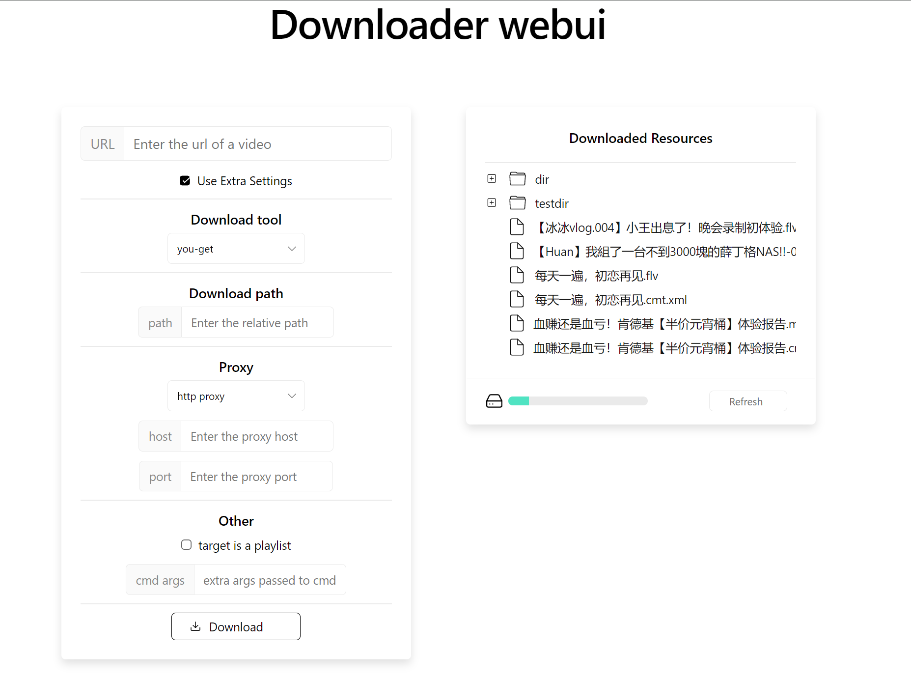

# downloader-ui
This is a website based on you-get, youtube-dl and other downloader program. It provide a web ui that's easier for user to download video.



## Deploy
### config
Before deploying the project, you should first change some settings.

In ```webui/src/config.js```, you should change ```baseUrl``` to the ip:port or domain name of the host.

### manual
The web use ```Python Flask``` as backend and ```React``` as frontend. So ensure the installation of ```Python``` and  ```npm```.

In ```src/``` run 
```
pip install -r requirements.txt
```
to install python dependencies.

Then in ```webui``` run 
```
npm install
npm run-script build
```
to install javascript dependencies and compile the website to ```webui/build```.

Finally in ```src``` run 
```
python app.py
```
to start the project. You can vist ```ip:port``` or domain name to visit the project.

### Docker
Run 
```
docker build . -t downloader
```
to build the image. Then run
```
docker run -d --name downloader -v ${PATH/TO/YOU/VOL}:/dl/src/dl -p 21991:21991 --restart always downloader
```
to run the container.

## Usage
Currently the project supports three kinds of download tools. 

For you-get you just need to fill every options and click download.

For youtube-dl you should notice that playlist function is unable to set.

And for wget, socks proxy is also useless. But you can enable ```Force CMD args``` to ignore all settings in the web except that in ```cmd args```, and that performs just like 
```
wget $(CMD ARGS)
```
Then you can do anything using wget.